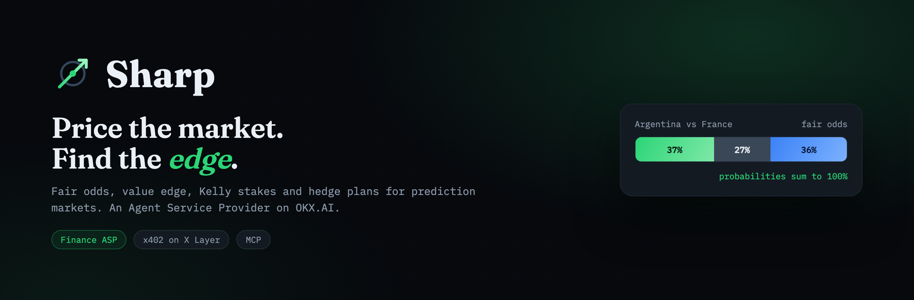
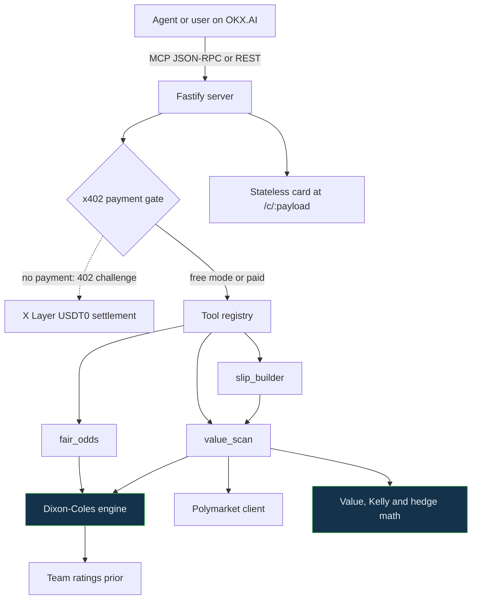

# Sharp



**Live demo:** [sharp-rho.vercel.app](https://sharp-rho.vercel.app) &nbsp;·&nbsp; **On OKX.AI:** Agent `#6323` &nbsp;·&nbsp; **Track:** Finance Copilot &nbsp;·&nbsp; **Settles:** USDT0 on X Layer via x402

**Demo thread:** [x.com/JanhaviChavada](https://x.com/JanhaviChavada/status/2078040771295596748)

Fair odds and value edge for football and prediction markets, delivered as an Agent Service Provider (A2MCP) on [OKX.AI](https://www.okx.ai). Sharp prices a match with a calibrated statistical model, compares that price to the live market, and reports where the market is wrong. It returns fair probabilities, a value edge, a Kelly stake, and a hedge plan. Built for the [OKX.AI Genesis Hackathon](https://www.hackquest.io/hackathons/OKXAI-Genesis-Hackathon).

## The problem

Prediction agents on marketplaces and betting markets usually do one of two things, and both are weak:

1. They guess an outcome or a scoreline, often inventing numbers with no model behind them.
2. They output probabilities that are not calibrated. The most-sold World Cup agent on OKX.AI has reviews pointing out that its win, draw, and loss probabilities add up to 125 percent.

A probability set that does not sum to 100 percent cannot be trusted to price anything, and a raw prediction does not tell you whether the market price is a good deal. Users and other agents are left without a number they can size a decision on.

## What Sharp does and why it matters

Sharp turns "who will win" into "what is it worth, and where is the market wrong." For any match or market it returns:

- Calibrated home, draw, and away probabilities that always sum to 100 percent.
- The fair decimal odds and the three most likely scorelines.
- The value edge against the live market price, plus the expected value.
- A Kelly stake sized for growth with a variance cap.
- A hedge plan that shows how to lock a result, and flags an arbitrage when one exists.

Because it runs as an A2MCP service, any agent on OKX.AI can call Sharp before it places or prices a bet, and pay per call over x402 on X Layer. The output is deterministic and reproducible: the same inputs give the same numbers, and every shareable card can be regenerated from its link. That makes Sharp a pricing primitive other agents can build on, not a one-off chatbot answer.

## Architecture



Everything runs as a single service. Deterministic math (the model, the value and hedge calculations) is separated from I/O (the server, the Polymarket client). Cards are stateless, so the whole thing runs on serverless without shared memory.

## The quant strategy

Sharp is built from four standard quantitative methods, each implemented as pure functions and covered by tests.

**1. Calibrated pricing (Dixon-Coles).** Team attack and defense ratings produce expected goals for each side. A bivariate Poisson score matrix is built up to ten goals per team, with the Dixon-Coles correction for the dependence between low scores. The matrix is renormalized so the outcome probabilities sum to exactly 1. This is why Sharp's probabilities always total 100 percent.

**2. Value detection (de-vig and edge).** Market decimal odds are converted to implied prices and de-vigged (scaled so they sum to 1) to recover the market's fair probability. The edge is how much more likely Sharp's model thinks an outcome is than the price you pay implies. Only positive-edge outcomes are worth backing.

**3. Position sizing (fractional Kelly).** Stakes use the Kelly criterion, `f = (b·p - q) / b`, which maximizes long-run growth. Sharp caps it at quarter Kelly by default and clamps any no-edge bet to zero, so sizing stays disciplined and drawdowns stay bounded.

**4. Hedging and arbitrage.** Given the odds across all outcomes, Sharp computes the equal-payout split: stake each outcome in proportion to `1/odds`. Every outcome then returns the same amount. The locked return is `1/k - 1`, where `k` is the sum of `1/odds` across outcomes. When `k` is below 1 this is a genuine arbitrage with a guaranteed profit; when it is above 1 the number tells you the cost of removing all variance. For parlays, the combined edge assumes leg independence and Sharp says so, because correlated legs inflate it.

Full detail is in [docs/METHODOLOGY.md](docs/METHODOLOGY.md).

## Services

| Tool | Endpoint | Price | Returns |
| --- | --- | --- | --- |
| `fair_odds` | `POST /fair-odds` | 0.02 USDT | Calibrated probabilities, fair odds, top three scores |
| `value_scan` | `POST /value-scan` | 0.10 USDT | Edge, expected value, Kelly stake, hedge plan, verdict |
| `slip_builder` | `POST /slip` | 0.25 USDT | Best value legs across a slate, combined edge |

All three are also exposed over MCP at `POST /mcp` and rendered as a shareable card at `GET /c/:payload`.

## Quick start

```bash
npm install
cp .env.example .env
npm test
npm start
```

```bash
curl -s -X POST localhost:8787/fair-odds \
  -H 'content-type: application/json' \
  -d '{"home":"Argentina","away":"France"}'
```

## Status

Live and running in production, verified end to end:

- Deployed at [sharp-rho.vercel.app](https://sharp-rho.vercel.app), auto-deploying from `main`.
- Registered on OKX.AI as Agent `#6323` (Finance), running in **x402 paid mode**: `fair_odds`, `value_scan`, and `slip_builder` return a `402` challenge that settles in USDT0 on X Layer (chain 196).
- 17 unit tests plus `npm run selfcheck` pass (model normalization, de-vig, Kelly, hedge, the three services, MCP discovery, and card rendering).

### Settlement wallet

Paid calls settle to the project's OKX Agentic Wallet on X Layer:

```
0x68cf8bfd4c5737be62dcfc3e4cfd7e9cea2ff016
```

This is an **OnchainOS Agentic Wallet**, not a browser-extension or seed-phrase wallet. Its private key is generated and held inside a **TEE (trusted execution environment)** and never leaves the enclave, so it cannot be exported or imported elsewhere. It is controlled through an email login via the OnchainOS agent, and it is the on-chain owner of Agent `#6323`. Every x402 challenge Sharp returns names this address as `payTo`, and payments settle to it in USDT0.

## Deploy

The repo is configured for Vercel (`vercel.json` plus a serverless entry at `api/index.ts`) and connected to this GitHub repository, so every push to `main` deploys automatically. The public URL is detected from Vercel's environment, so no manual URL configuration is needed. `PAYMENT_MODE` defaults to `off` (every tool free); set it to `x402` with `PAYMENT_PAY_TO` to charge per call.

## Going live on OKX.AI

This ASP is already registered as Agent `#6323`. To reproduce the flow:

1. Install the OnchainOS CLI, then in your agent run `npx skills add okx/onchainos-skills --yes -g` and log into the Agentic Wallet with your email. That wallet is your X Layer identity and receiving address.
2. Register the identity and list the services (`agent create --role asp …`, then `agent activate`). In free mode it goes live right away.
3. To charge, set `PAYMENT_MODE=x402` and `PAYMENT_PAY_TO` to your X Layer address. Paid calls then return an x402 challenge and settle in USDT0.
4. Verify with `curl -i -X POST <url>/fair-odds` (200 in free mode, 402 with a `PAYMENT-REQUIRED` header in x402 mode), or run `npm run selfcheck`.

Listing fields, the participation post, and a 90-second demo script are in [docs/okx-submission-kit.md](docs/okx-submission-kit.md).

## License

MIT
